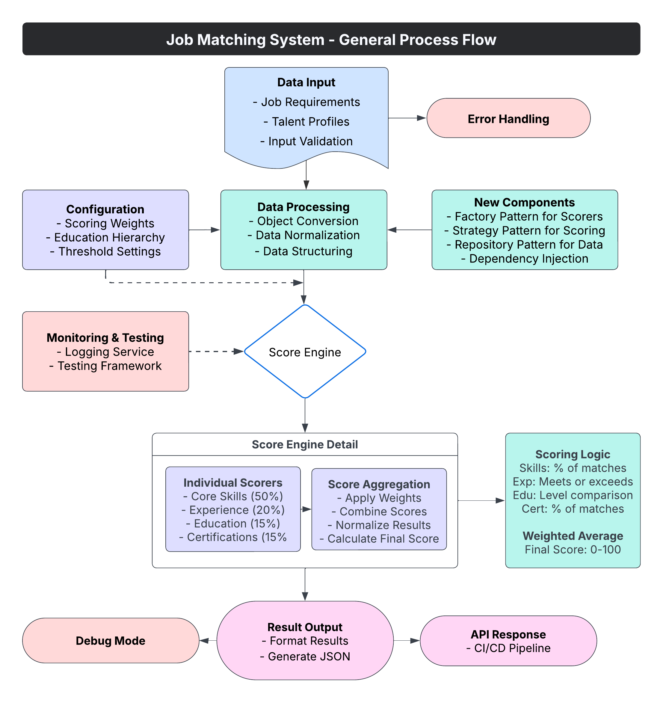

# Job Matching System - Enhanced Architecture

A modular job matching system that quantitatively scores candidate-job fit based on weighted skills, experience, education, and certification criteria.

This repository contains a conceptual implementation designed for improved maintainability, scalability, and extensibility. This architecture represents a proposed solution that would need further testing and validation in a real-world environment.

## Live Demo

A proof of concept is available at: [https://job-matching-system-t1.streamlit.app/](https://job-matching-system-t1.streamlit.app/)

## Architecture

The system follows a modular process flow as illustrated in the diagram below:



## Project Overview

The system has been designed to address the following objectives:

1. **Improve Maintainability** - Modular design with clear separation of concerns
2. **Enhance Debuggability** - Comprehensive logging and debug mode
3. **Enable Future Extensions** - Flexible architecture for new scoring components or ML models
4. **Support Data Upload** - Ability to analyze custom uploaded data

## Project Structure

```
job_matching/
├── app.py                    # Main application file (entry point)
├── config/
│   └── scoring_config.yaml   # Configuration for weights and thresholds
├── data/
│   └── sample_jobs.json      # Sample job and talent data
├── modules/
│   ├── __init__.py           # Makes the directory a package
│   ├── config_manager.py     # Configuration management
│   ├── data_manager.py       # Data loading and validation
│   ├── scoring_service.py    # Scoring logic
│   └── visualization.py      # Data visualization components
├── ui/
│   ├── __init__.py           # Makes the directory a package
│   ├── dashboard.py          # Dashboard tab UI components
│   ├── data_input.py         # Data input tab UI components
│   ├── data_upload.py        # Data upload tab UI components
│   └── common.py             # Common UI elements
└── utils/
    ├── __init__.py           # Makes the directory a package
    └── helpers.py            # Helper functions
```

## Conceptual Features

This architecture proposes the following features, which would need to be validated through implementation and testing:

### Dashboard Tab
- Interactive visualization of job matching scores
- Weight adjustment for different scoring components
- Detailed breakdown of scoring results
- Export options for results (JSON, CSV)

### Data Input Tab
- Custom job application form
- Real-time scoring and visualization
- Component-level score breakdown

### Upload Data Tab
- Upload JSON files containing job applications
- Paste JSON content directly
- Load sample data with one click
- Data validation and error handling

## Architecture Design Principles

1. **Separation of Concerns**
   - Scoring logic separated from UI components
   - Configuration management in dedicated module
   - Data handling separate from visualization

2. **Modular Design**
   - Each component has a single responsibility
   - Clear interfaces between modules
   - Easy to extend with new functionality

3. **Configuration Externalization**
   - Weights and thresholds in external config
   - Education hierarchy defined in config
   - Easy to adjust parameters without code changes

4. **Improved Error Handling**
   - Comprehensive validation for data input
   - Clear error messages for users
   - Graceful fallback to defaults

## Implementation Considerations

This conceptual architecture would require:

1. Installation of dependencies like streamlit, pandas, numpy, and pyyaml
2. Testing in production-like environments to validate the design
3. Performance testing with realistic data volumes
4. Security review before deployment to production

## Notes

This repository represents an architectural concept and would need to be thoroughly tested in a real-world scenario before implementation. The code structure and approach shown here serve as a reference for how such a system could be built, but are not guaranteed to be production-ready without additional testing and refinement.
